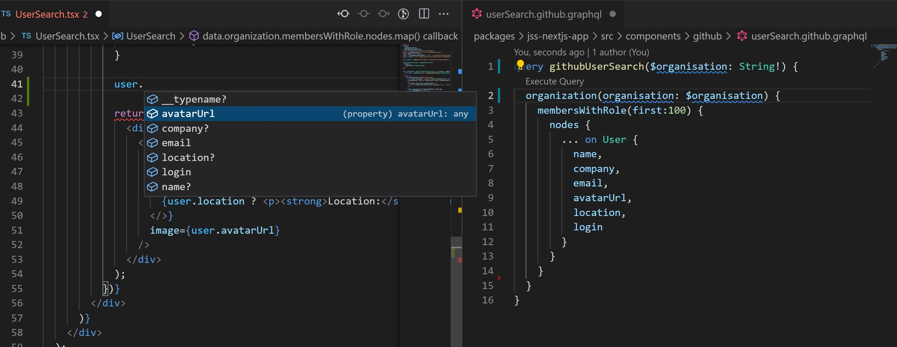

## Sitecore JSS GraphQL out of the box
The Sitecore JSS Next.js SDK has great built-in [tooling](https://doc.sitecore.com/en/developers/hd/190/sitecore-headless-development/use-graphql-to-fetch-component-level-data-in-jss-next-js-apps.html) for querying the Sitecore GraphQL endpoint. 
In this blog post, I will explain how to use the same tooling but for external data sources. 

## Consume external Graphql API 
For demo purposes, I picked the excellent API from GitHub. This is free to use, the only thing you need is a [personal access token](https://docs.github.com/en/authentication/keeping-your-account-and-data-secure/creating-a-personal-access-token). When that's all set up you can use the [explorer](https://docs.github.com/en/graphql/overview/explorer) to explore all the data you can fetch. 

### Extend introspection script
Sitecore JSS uses [graphql-let](https://github.com/piglovesyou/graphql-let) for automatically generating types for the GraphQL results. A .graphql file is automatically picked up by this tool. It analyses the query and as a result, generates a .d.ts file next to it. 
With this .d.ts file you can import the required types:

```javascript
import { GithubUserSearchQuery } from "./userSearch.github.graphql";
```

Before this is possible graphql-let needs an introspection schema. The schema is created by the [graphl-update](https://doc.sitecore.com/en/developers/hd/190/sitecore-headless-development/introspecting-the-graphql-schema-in-jss-next-js-apps.html) task.

To add the GitHub introspection schema we need to extend the script `scripts\fetch-graphql-introspection-data.ts` with an introspection call to the GitHub GraphQL endpoint:

```javascript
(async function() {
  
  try {
    const introSpectionQuery = {}

    const githubResults = await fetch("https://api.github.com/graphql", {
      method: "POST",
      headers: {
        "Content-Type": "application/json",
        "Authorization": `bearer ${process.env.GHUB_PRIVATE_KEY}`
      },
      body: JSON.stringify(introSpectionQuery)
    });

    const githubData = await githubResults.json();
    fs.writeFile(
      "./src/temp/GraphQLIntrospectionResultGithub.json",
      JSON.stringify(githubData, null, 2),
      (err) => {
        if (err) {
          console.error("Error writing GraphQLIntrospectionResultGithub file", err);
          return;
        }

        console.log("GraphQL Github Introspection Data successfully fetched!");
      }
    );
  } catch (e) {
    console.error(e);
    process.exit(1);
  }
}());

```

I used this [introspection query](https://gist.github.com/craigbeck/b90915d49fda19d5b2b17ead14dcd6da) to get all the required types. 
Now when you run **npm run update:graphql** you get a nice big schema with all the types from the GitHub GraphQL API.

### Add additional graphql-let configuration file
To point graphql-let to this schema file I've added this file to the root of the project **.graphql-let-github**
```yml
    schema:
    - './src/temp/GraphQLIntrospectionResultGithub.json'
    documents: 'src/**/*.github.graphql'
    plugins:
    - typescript
    - typescript-operations
    - typed-document-node

    cacheDir: .generated
    config:
        useIndexSignature: true
```

Change the **bootstrap** npm script to:
```json
"bootstrap": "ts-node --project tsconfig.scripts.json scripts/bootstrap.ts && graphql-let && graphql-let --config .graphql-let-github.yml"
```

This generates all the types when running **npm start**

To also receive updated types while you're actively developing update **next.config.js** with the following lines:

```javascript
const applyGraphQLCodeGenerationLoaders = (config, options) => {
  config.module.rules.push({
    test: /\.sitecore.graphql$/,
    exclude: /node_modules/,
    use: [options.defaultLoaders.babel, { loader: 'graphql-let/loader' }],
  })

  config.module.rules.push({
    test: /\.github.graphql$/,
    exclude: /node_modules/,
    use: [options.defaultLoaders.babel, { loader: 'graphql-let/loader', options: { configFile: ".graphql-let-github.yml" } }],
  })
```

As you see I suffix the Sitecore GraphQL queries with **.sitecore.graphql** and the GitHub queries with **.github.graphql**. Because both types of queries have their own configuration.

### Add a query to a component
Now that's all in place we can add some GraphQL data to a component. Next to the component that will consume the data, we will create **userSearch.github.graphql**:

```graphql
query githubUserSearch($organisation: String!) { 
  organization(login: $organisation) {
    membersWithRole(first:100) {
      nodes {
        ... on User {
          name, 
          company,
          email,
          avatarUrl,
          location,
          login
        }
      }
    }
  }
}
```
This query accepts an Organisation as a parameter. The query asks for the first 100 members of the organisation found. Within the nodes, the User Fragment is used to get a couple of properties of each user. 

To get this data into the component as static props (so the query is done on build-time) the method **getStaticProps** needs to be exported. With Next.js this can usually only be done on page level but Sitecore JSS added some magic to also allow this on component level:

```javascript
const query = require('raw-loader!./userSearch.github.graphql').default;

export const getStaticProps: GetStaticComponentProps = async (rendering) => {
  try {
    const githubResults = await fetch("https://api.github.com/graphql", {
      method: "POST",
      headers: {
        "Content-Type": "application/json",
        "Authorization": `bearer ${process.env.GHUB_PRIVATE_KEY}`
      },
      
      body: JSON.stringify({
        query: query,
        variables: { organisation: rendering.fields?.organisation?.value }
      })
    });

    const githubData = await githubResults.json();

    return githubData.data;
  } catch(e) {
    console.error(e);
    return null;
  }
};
```
The organisation field is passed down from Sitecore, so the content editor can pick the GitHub organisation. [Read more](https://doc.sitecore.com/en/developers/hd/190/sitecore-headless-development/create-a-new-component-in-a-jss-next-js-app-using-the-code-first-development-workflow.html) on how to add fields to components using the JSS Cli (I prefer this over clicking away in the Sitecore admin).

Within the component the data can now be consumed with the **useComponentProps** hook:

```javascript
import { GetStaticComponentProps } from "@sitecore-jss/sitecore-jss-nextjs";
import { GithubUserSearchQuery } from "./userSearch.github.graphql";

const UserSearch: React.FC<UserSearchProps> = ({ fields, rendering }): JSX.Element => {
    const data = rendering.uid ? useComponentProps<GithubUserSearchQuery>(rendering.uid) : null;
```

With the type added to the **useComponentProps** function we get IntelliSense based on the query we created, how cool is that!

