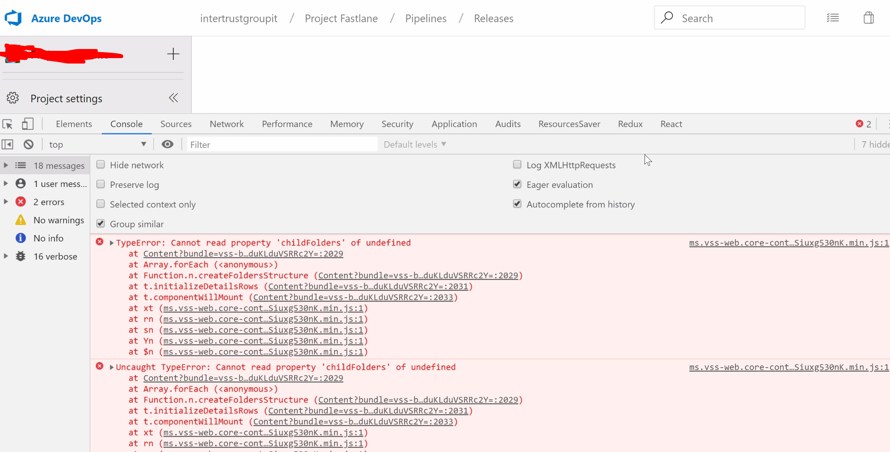
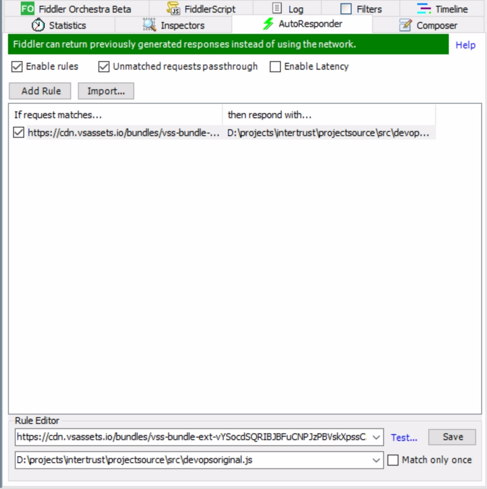
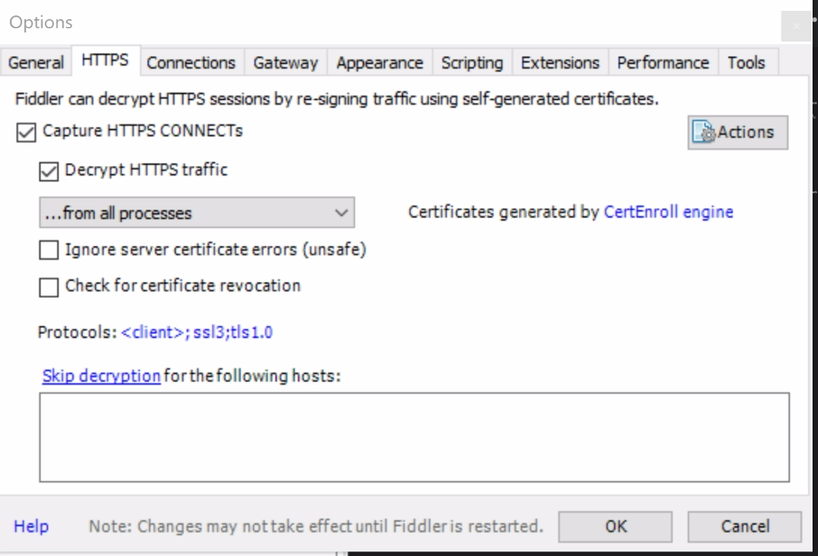

## Problems creating a new release pipeline in Azure Devops

Currently I'm working on a project that uses a monorepo using LernaJS for building several microsites.
Because of this setup we have quite a lot of release pipelines setup in Azure Devops, I'm not sure if it's because of our setup but recently we couldn't create new pipelines anymore because of a runtime javascript error. 



Now this was really annoying because it stopped our progress on the project, so I spend some time on creating a 'hackery' workaround for this. I thought if I could find the bit of code responsible for this and inject this fix using Fiddler we can continue working on releasing our microsites. 

1. Download the javascript file responsible for the runtime error.
The file is currently located on https://cdn.vsassets.io/bundles/vss-bundle-ext-vYSocdSQRIBJBFuCNPJzPBVskXpssC5hGD4GQk8iu_sI=

Please note that this url will probably change soon, hopefully this error will be gone than anyway. 

Download the file and beautify the javascript using your favourite 'beautifier'. Now the code should be readable-ish. 

In the beautified code there is a function called 'createFoldersStructure'. 

At the bottom of the function there is a bit of code that looks like this:
```jsx
}, o[p.toLowerCase()].childFolders.push(c), o[l.toLowerCase()] = c), v++
```

All I did to stop this line of code from causing an error is adding some defensive programming:
```jsx
}, o[p.toLowerCase()] ? o[p.toLowerCase()].childFolders.push(c) : null, o[l.toLowerCase()] = c), v++
```

Now to actually get this fix implemented let's set up Fiddler.

2. Set up the fiddler autoresponder. 
Make sure your fiddler autoresponder configuration looks like this:



If you haven't used fiddler over https before you might have to configure the certificate to allow fiddler to work on https calls.

Make sure your settings look like this, when you click the 'decrypt' checkbox fiddler automatically adds a SSL certificate for you. 



I think you can also do similar stuff using the chrome devtools now, but I always find Fiddler great for fixing and debugging issues like this. 

Hope this helps anyone that experiences the same issue!. We did log this issue [here](https://developercommunity.visualstudio.com/content/problem/610555/cannot-saveclone-release-definition.html), so hopefully it will be resolved soon. 