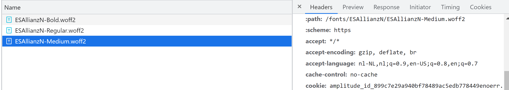

By default assets from the public directory have no cache headers set. Usually you have assets that never change and are quite large in this directory. In a recent project I noticed that our font files were loaded on each browser request. As shown in the screenshot there is no cache header on the font file.



This is easily solved by adding header configuration to your **next.config.js** file:

```javascript
 async headers() {
    return [
        {
            source: '/fonts/(.*)',
            headers: [
                { 
                    key: 'Cache-Control',
                    value: 'public, max-age=31536000, stale-while-revalidate',
                }
            ]
        }
    ]
}
```

A font file never changes and is usually quite large, so this will save a lot of bandwidth!