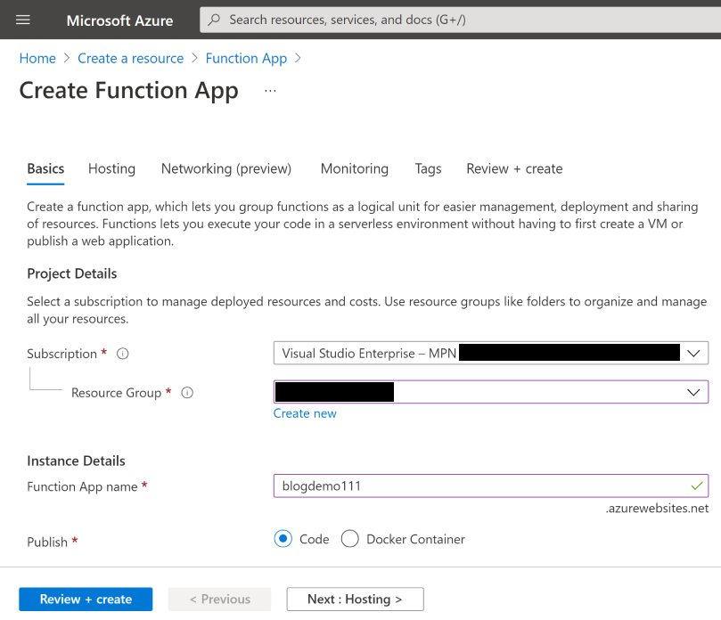
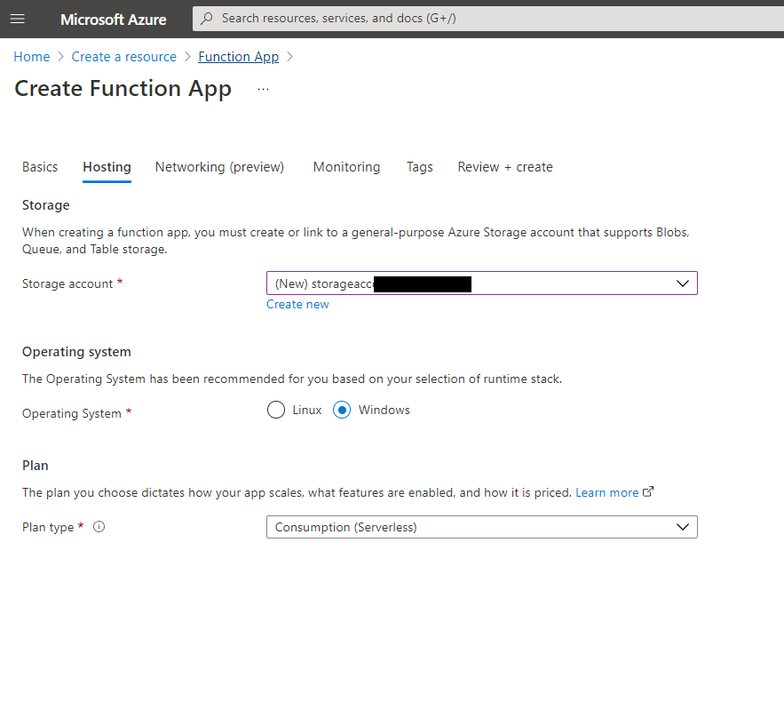
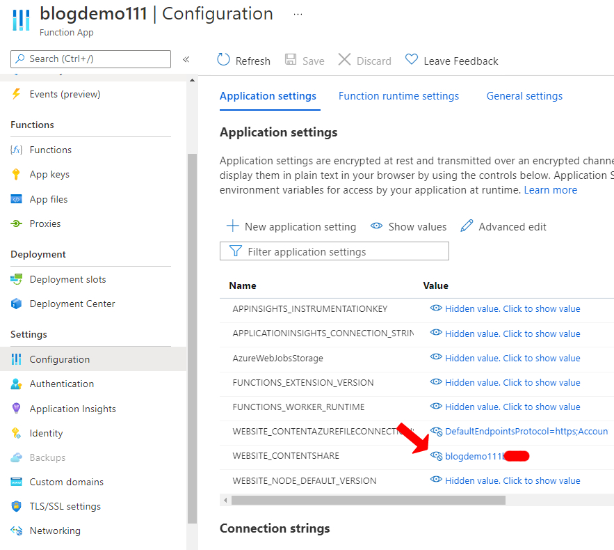
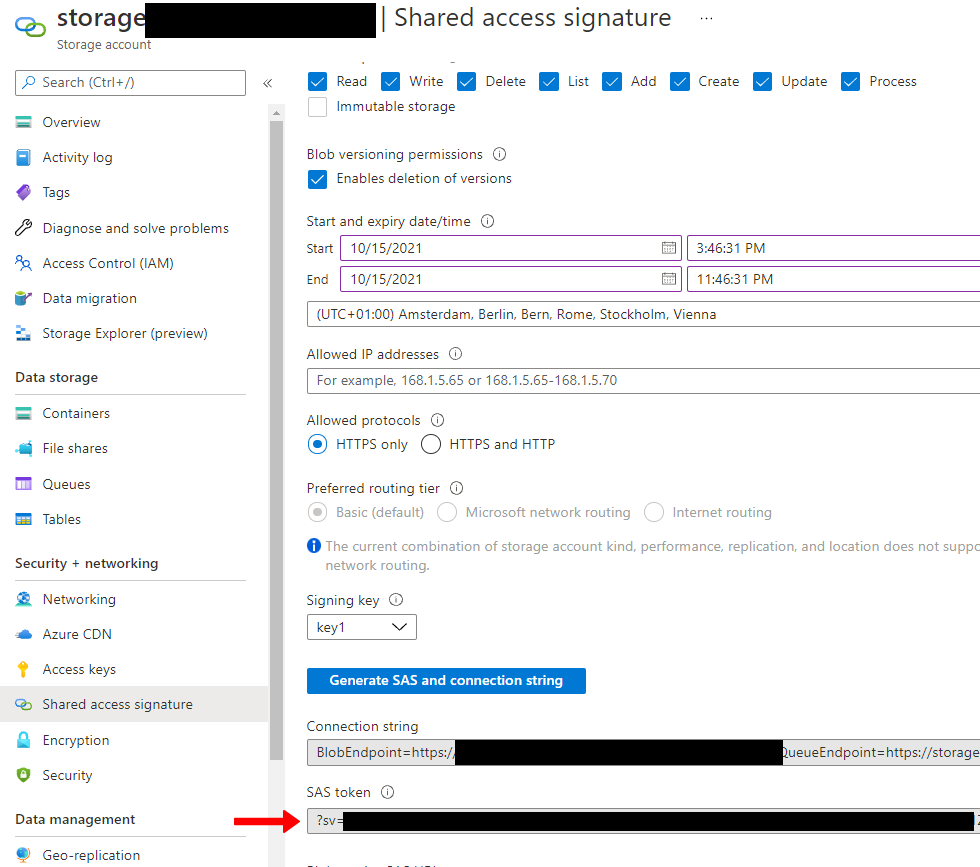
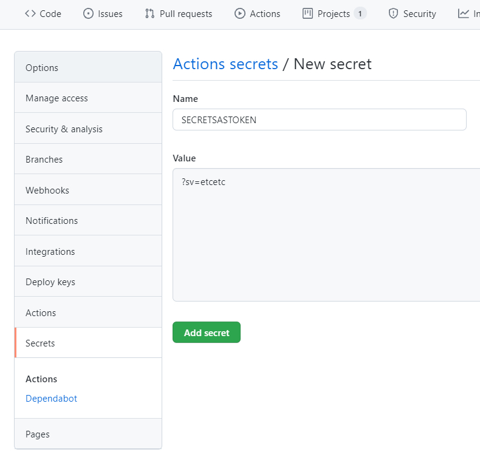

When deploying Azure Functions the most straightforward approach is to use the **actions/checkout@v2** [recommended by Azure](https://docs.microsoft.com/en-us/azure/azure-functions/functions-how-to-github-actions)

However, there are some restrictions with this approach. Using this approach. The Azure Functions will only work using the **[Run from package option](https://docs.microsoft.com/en-us/azure/azure-functions/run-functions-from-deployment-package)**. There are two reasons why this wasn't great for a [Next.js custom server](/nextjs-on-azure-functions).

1. Next.js requires to have write access for its [Incremental Static Generation](https://nextjs.org/docs/basic-features/data-fetching#incremental-static-regeneration). With the **Run from package option** you can't use this feature.

2. Because there is no write access it's also not possible to use the [Azure App Service Editor](https://social.technet.microsoft.com/wiki/contents/articles/36467.understanding-the-azure-app-service-editor.aspx). During development I love this feature to test changes quickly without having to wait for deployments.

## Alternative ways for deploying Azure Function with GitHub Actions

### Using the Azure CLI
Instead of using the recommended **actions/checkout@v2** it's also possible to use the Azure CLI directly in the .yml file. Before doing so, it's required to run a [login command](https://github.com/marketplace/actions/azure-login) first. To run this you'll need deployment credentials which can be generated through the [Azure Cloud Shell](https://docs.microsoft.com/en-us/azure/cloud-shell/quickstart) for example. 

If you have the required permissions within your organisation you're in business! Now you can run all the [deploy commands](https://docs.microsoft.com/en-us/cli/azure/functionapp/deployment) available for Azure Functions. 

I did not have the required permissions to create deployment credentials. Also, when trying to run this locally I found the deployments pretty slow. Just the Azure Functions are deployed quickly but with the Azure Functions also came a big Next.js build folder and their NPM dependencies (with and without remote builds). 

### Using AZ Copy 
This is the solution I picked for deploying Azure Functions. It's reasonably quick for big projects and I have full access to the Azure App Service Editor and write access. Let's show the implementation step by step.

1. **Create the Function App**


2. **Select or create a new storage account**


3. **See how the Function App is connected**


This helped me to understand how the deployments to Azure Function Apps work. I figured out that all it takes is to upload a set of files to the `wwwroot` folder of the `fileshare` within the storage account.

4. **Set up the GitHub action**
See below an example on a yml I use for the deployment of an Azure Function. Place this file in the `.github` directory of your project and GitHub will automatically recognise the file and add the Action to the UI.

Personally, I like to use the `workflow_dispatch` event. I don't like to run a full build on each time I push some code. 


```yml
name: Deploy Azure Function

on:
  [workflow_dispatch]

env:
  NODE_VERSION: '14.x'
  ## Enter the path to your storage account and include the name of the file share
  AZUREFUNCDEST: 'https://${pathtostoreageaccount}.file.core.windows.net/${filesharename}/site/wwwroot'

jobs:
  build-and-deploy:
    runs-on: windows-latest
    steps:
    - name: 'Checkout GitHub Action'
      uses: actions/checkout@main

    - name: Setup Node ${{ env.NODE_VERSION }} Environment
      uses: actions/setup-node@v1
      with:
        node-version: ${{ env.NODE_VERSION }}

    ## Install a community package that adds the azcopy tool
    - name: Install azcopy
      uses: kheiakiyama/install-azcopy-action@v1.0.3

    ## Build your application, replace Lerna with NPM/Yarn if that's more suitable for your project
    - name: 'Lerna bootstrap & azure functions build'
      shell: pwsh
      run: |
        lerna bootstrap
        npm run build
        popd

    ## Clean up the directory before copying the new stuff over
    - uses: kheiakiyama/install-azcopy-action@v1
      with:
        version: 'v10'
    - run: azcopy_v10 rm '${{ env.AZUREFUNCDEST }}?${{ secrets.SECRETSASTOKEN }}' --recursive

    ## Copy the contents of the azure functions
    - uses: kheiakiyama/install-azcopy-action@v1
      with:
        version: 'v10'
    - run: azcopy_v10 copy './packages/azure-functions/*' '${{ env.AZUREFUNCDEST }}?${{ secrets.SECRETSASTOKEN }}' --recursive
```

To authenticate the copying of the files, generate a SAS Token on the storage account.


Add the SAS Token to the GitHub secrets:


There you go, now you can run the GitHub action and your Azure Function will be deployed. Hopefully, this could be a useful alternative for deploying Azure Functions using GitHub Actions! 
