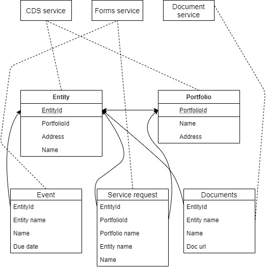
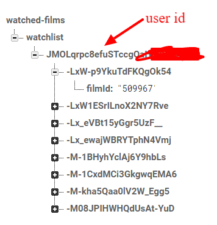
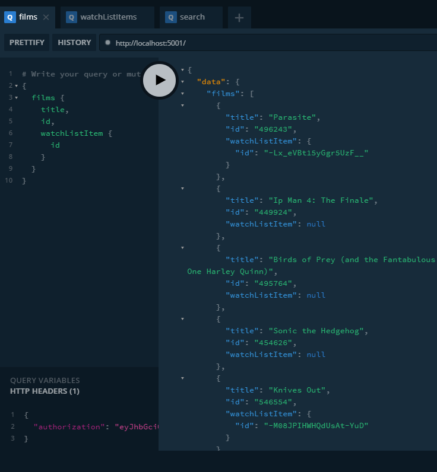
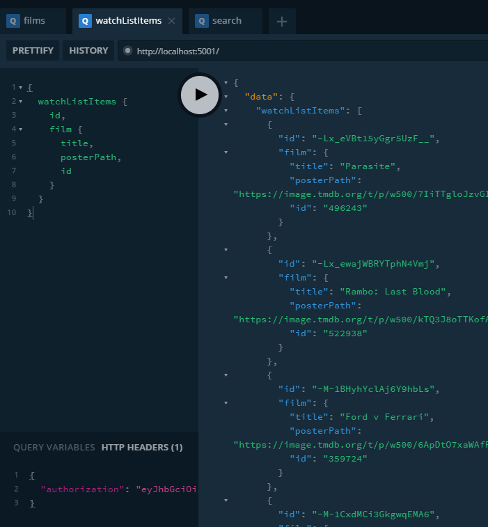

## Why?
At a project I'm working on we have to build a single page application with authentication that needs to query data from multiple data services. 

There are also a lot of examples where we need to 'stitch' these services together. Let's have a look at the domain model and the corresponding services:



Note that I'm not really a pro drawing things with draw.io...
But you get the point, if we fetch service requests for example. We also have to get the related entity & portfolio for every single service request. Currently we do this with separate api calls and it works but it complicates loading states and it makes the frontend application harder to work with.

Would it not be nice to get a list of service requests, without having to create 3 api calls from the frontend? Of course this can all be done on the server, but if the requirements change all needs to be updated. For example, if the business decides it doesn't want entity information on a service request we can remove it from the frontend but the server will still fetch all the data, what a waste! This is where graphql shines, there is a clear connection between the client and the server on the data it actually needs. 

Graphql provides a nice query language for querying the date you want with nested objects supported as well. 

A query for fetching service requests with the related entities and portfolios would look like this:

```graphql
query getServiceRequests {
    ServiceRequests {
        entity {
            name,
            address
        }
        portfolio {
            name,
            address
        },
        name   
    }
}
```

This query will return a list with the service requests but with the entity and portfolio objects already embedded, nice!

To actually perform this query and stitch all the data together we can use "Apollo Federation":
https://www.apollographql.com/docs/apollo-server/federation/introduction/


## Watchlist sideproject
I decided to have a play with this using a hobby project. This project called "watchlist" allows me to search for films and add them to my watchlist. I would like to expand it with ratings and sharing functionality but that's for later.

I decided on using themoviedb.org as a source for the films and firebase.google.com for saving films to my watchlist. 

The watchlist items are saved in firebase in this structure:



Firebase is using a folder structure, userId is used to group all the watchlist items under the correct user. This way I can simply query everything from a specific directory knowing that it's all scoped to the correct user.

Eventually I would like to query films and find out from each film if it's added to watchlist yet. 

The other way round I want to query my watchlist and have all the film information embbeded without having to query the filmservice separately. 

## Setting up the apollo gateway
To use Apollo federation you have to create separate services which can be tied together with a "gateway".

The gateway looks like this:

```javascript
const gateway = new ApolloGateway({
  serviceList: [
    { name: "watchListItems", url: "http://localhost:5002" },
    { name: "films", url: "http://localhost:5003" },
  ],
  buildService({ name, url }) {
    return new AuthenticatedDataSource({ url });
  }
});
```

Because I can only return watchlistitems if the user is authenticated I have to pass an Auth token from my frontend application. In the gateway this token is translated into a userId. The userId is placed on the context, context is a mechanism that allows apollo server to add variables to a global scope which can be accessed anywhere within the scope of the request. 

```javascript
const server = new ApolloServer({
  gateway,
  context: async({ req, context }) => {
    const token = req.headers.authorization || "";
    try {
      const user = await firebaseApp.auth().verifyIdToken(token);
      return {
        userId: user.user_id
      }
    } catch(e) {
      console.error(e);
      return {
        userId: undefined
      }
    }
  },
  subscriptions: false
});
```

The context only lives within the 'gateway' not in the underlying services. So after the userId is extracted from the token we pass it through using the http headers.

```javascript
class AuthenticatedDataSource extends RemoteGraphQLDataSource {
  willSendRequest({ request, context }) {
    if (context.userId) {
      request.http.headers.set('userid', context.userId);
    }
  }
}
```

## Creating the films service
The typedefs for this service are as follows:

```graphql
  type Film @key(fields: "id") {
    id: ID!
    posterPath: String
    title: String!
    watchListItem: WatchListItem @provides(fields: "filmId")
  }

  extend type WatchListItem @key(fields: "filmId") {
    filmId: String! @external
    id: ID! @external
  }
   
  type Query {
    films: [Film]
  }
```

By adding @key(fields: "id") to Film we ensure this type will be able to referenced by other services.
In the Film type there is a reference to WatchListItem, because this will be resolved by other services we add the @provides keyword with the field "filmId" which can be used to resolve the type.

The WatchListItem item lives in another service, so we need to create an extension in this services. That's done by the "extend type" keyword. 

Resolvers:
```javascript
const resolvers = {
  Query: {
    films(parentValue, args, { dataSources }) {
      return dataSources.filmsApi.getTrendingFilms();
    }
  },
  Film: {
    __resolveReference(reference, { dataSources }) {
      return dataSources.filmsApi.getFilmById(reference.id);
    },
    watchListItem(film, args) {
      return { __typename: "WatchListItem", filmId: film.id, userId: args.userId };
    },
  }
};
```
To resolve the watchListItem type we need to add a resolver that provides the correct fields to the external service. That's done with the this line `return { __typename: "WatchListItem", filmId: film.id, userId: args.userId };`

If we want other services to consume the Film type we need the __resolveReference method within the type resolver. Within this method the related dataservice method is attached. 

After the types and the resolvers are set up correctly the federated service is created:

```javascript
const server = new ApolloServer({
  dataSources: () => {
    return {
      filmsApi: new FilmsApi(),
    };
  },
  schema: buildFederatedSchema([{ 
    typeDefs, 
    resolvers
  }])
})

```

## Creating the watchlist service
Because we need the userId within this service we get the userId from the requestHeaders and add it to the context. This ensures it's always available within all the resolvers. 

```javascript
const server = new ApolloServer({
    dataSources: () => {
        return {
            watchListApi: new WatchListApi(),
        };
    },
    schema: buildFederatedSchema([{ typeDefs, resolvers }]),
    context: async ({ req }) => {
        const userId = req.headers.userid;
    
        return {
            userId: userId
        }
    }
})
```

In the typedefs an external reference to type Film is added using the @provides keyword. In the external type we only set the @external id. Note that within the query it's possible to also request all the other fields within the Film type. 

```javascript
  type WatchListItem @key(fields: "id") {
    id: ID!
    filmId: String!
    film: Film @provides(fields: "id")
  }

  extend type Film @key(fields: "id") {
    id: ID! @external
  }

  type Query {
    watchListItems: [WatchListItem]
  }
```  

Within the resolvers we specify how the WatchListItem is resolved when it's requested from another service. Within the film type we tell the resolver to try to get it from another service by only returning `{ __typename: "Film", id: watchListItem.filmId };`
```javascript
const resolvers = {
    Query: {
        watchListItems: async (parentValue, args, { dataSources, userId }) => {
            return dataSources.watchListApi.getWatchListItems(userId);
        }
    },
    WatchListItem: {
        async __resolveReference({filmId}, context) {
            return context.dataSources.watchListApi.getWatchListItemByFilmId(context.userId, filmId);
        },
        film(watchListItem) {
            return { __typename: "Film", id: watchListItem.filmId };
        }
    }
};
```

Now with this setup we can execute queries that will consume both services (see below for some examples). When using the graphql explorer we add the auth token to the http header to get the results we want.




In future blogposts I would like to dive deeper into the apollo-client and optimising the dataservices. Explore the caching options both on the client and on the server.

For now the rest of the source code is available on:
https://github.com/erwinsmit/watchlist


