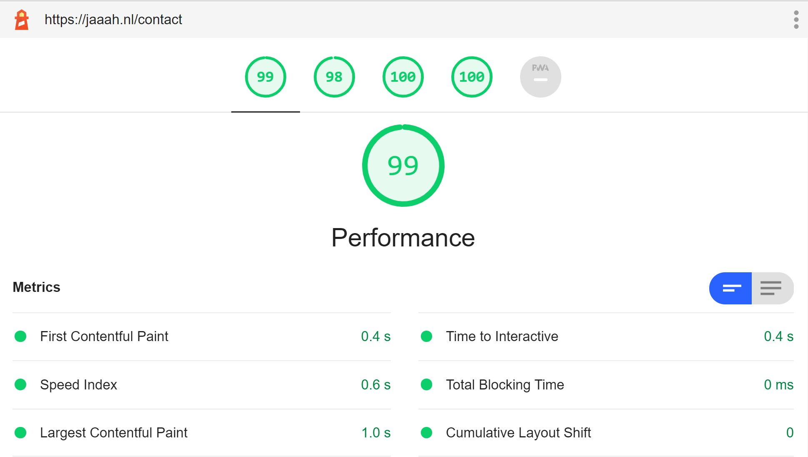

## The problems with Sitecore SXA and frontend code
To put it bluntly, the performance from sxa out of the box is not great. Let's have a look at the lighthouse report with the standard theme switched on. 


As we can see we lose 0.8 seconds with unused javascript, that time alone should already be enough to load a whole website. But instead we just loaded javascript that is just sitting there doing nothing! With the unused css combined we can gain almost a full second by just removing what we don't actually use.

Let's have a look at the **javascript sources**

This 1.2MB of javascript! And this will be loaded on any page, so if you have a page with some rich text and no interaction you  will always get 1.2MB of javascript loaded on your page. Even for complex javascript applications this is a lot.

And the **css sources**

Also here, because SXA is including a lot of 3rd party css code and styling for components you might not even use this is pretty big (140kb).

## Where is this all coming from?
The standard theme in SXA is very bloated. To clarify this, the following list of libraries are included in the core-libraries theme. 

I left some comments on why you would not want this loaded on every page of your website

KB | Library | Comments
--- | --- | ---
332 | 'xaquery.min.js' | This is jquery wrapped in the XA namespace, so if you don't need/use it 332kb of unused javascript
212 |  fullcalendar.min.js | Required for the calendar component of SXA, because there is no lazy-loading, in most pages you will have 212kb of unused javascript
156 | 'mediaelement-and-player.min.js' | This library is a very old wrapper around the HTML5 component, unnecessary in this day and age
 72 |  galleria-157.min.js | This is used by the carousel component, do you want a carousel on every page, [do you even need a carousel](http://shouldiuseacarousel.com/)?
 72 |  lo-dash.min.js | With lodash you usually only need a couple of functions, however in this library they are nearly all included
 52 |  moment.min.js | [Deprecated](https://momentjs.com/docs/#/-project-status) and large library for displaying dates
 48 |  jquerymCustomScrollbar.min.js | Overwriting scrollbars with this library is an anti-pattern
 44 |  typeahead.min.js
 24 |  hammer.min.js
 20 |  backbone-min.min.js
 20 |  modernizr.min.js
  8 |  vimeo.min.js
  8 |  dailymotion.min.js
  8 |  twitch.min.js
  8 |  facebook.min.js
  8 |  gcal.min.js
  8 |  soundcloud.min.js
  4 | 'flash-polyfill (1).min.js'
  4 |  jqueryuitouch-punchmin.min.js
  4 |  ie-origin-fix.min.js

So with all the above code we are already above 1 mb, and that's just library code! This doesn't even include the custom components code which I won't go into, because this should already be enough motivation to do something about this. If you have this much unused javascript on your page your Google Lighthouse score will always be sub-optimal. 

**With our setup the average JS load on a page is only 30kb! (excluding google GTM / GA code).**

## How to fix this?

### 1. Remove all the SXA dependencies out of your theme
Remove everything so you can with a nice clean slate.
I know that it feels strange to do this, but if you want to unclutter, you have to ask yourself, does it [spark joy](https://knowyourmeme.com/memes/does-it-spark-joy)? If it doesn't, thank Sitecore for all the unused code and trash it! 


### 2. Install proper tooling for your frontend builds
If you want to use the out of the box tooling from SXA you don't have access to nice things like Typescript, automatic-tree shaking etc. This is solved by my colleague Serge, use this repository as a starting point for a good tooling setup:

https://github.com/macaw-interactive/sxa-umbrella

### 3. Use stencilJS for your components
Using stencil is a very nice way of developing React-like components that work everywhere without server side rendering. How? Under the hood they compile down to webcomponents. That means that you can add them to your site everywhere without the need of server-side rendering.

Usually you need server side rendering with similar frontend frameworks because the html won't be rendered without javascript enabled. With stencil however, you can add your h1 tag or p tags simply to the slots of the component. This way google will still index your site fine even if your javascript falls over. 

How does stencil help you with the performance? You get **code splitting** and **lazy loading** out of the box. So it doesn't matter if your theme contains 10 or 500 components, it will only load the javascript for the components that are actually on the page. From our experience you have about **30kb** of javascript on a page with a handful of components instead of the **1mb+** with the standard SXA theme switched on, quite a difference!

You also get things like data-binding, props, state management. So no need for libraries like backbone which is included in the standard SXA theme. 

### CSS building
We use **css purge** for removing unused css. Because we try to manage all the components in scriban templates and stencil components we know what html we use and don't use. This way we can also write as much css as we want without the worry of creating bloat for the end user.

This is out postcss setup to ensure our css is lean and mean:
```javascript
require('@fullhuman/postcss-purgecss')(
    {
        content: ['./**/*.scriban', './**/*.tsx', './stencil/src/**/*.js'],
        safelist: {
            greedy: [/pagemode-edit$/]
        }
    }
)
```

The result of this is that our css bundle is **14kb**, compared to the **140kb** when using the standard SXA theme. This won't be the biggest game changer, but if you add up all the marginal gains you get big gains!

## Final result
This is the lighthouse report on the latest SXA Website we build (unfortunately I can't share the url yet)



With a combined CSS/JS footprint of less then 50kb it's almost **25 times** more lightweight than the standard SXA theme!
