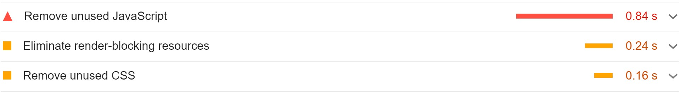

From my experience websites that are built using Sitecore SXA with the standard themes enabled don't perform very well. In this post I dive into the root cause of this problem and how to fix this.

## The problems with Sitecore SXA and frontend code
To put it bluntly, the performance from Sitecore out of the box is not great. We can measure this with [Google Lighthouse](https://developers.google.com/web/tools/lighthouse), a tool standard available in the Chrome browser that rates your website on performance (among other things).

Let's have a look at the Lighthouse report with the standard theme switched on. 



As we can see we lose 0.8 seconds with unused JavaScript, that time alone should already be enough to load a whole website. But instead we just loaded JavaScript that is just sitting there doing nothing! With the unused CSS combined we can gain almost a full second by just removing what we don't actually use.

Let's have a look at the **JavaScript sources**

That is 1.2MB of JavaScript! And this will be loaded on every page. So even if you have a page with some rich text and no interaction, you will still get 1.2MB of JavaScript loaded on your page. Even for complex JavaScript applications this is a lot.

And the **CSS sources**

Also here the amount of loaded CSS is huge, because SXA is including a lot of 3rd-party CSS code for styling components you might not even use.

## Where is this all coming from?
The standard theme in SXA is very bloated. To clarify this, the following list of libraries are included in the core-libraries base theme. 

I included some comments on why you would not want the respective library loaded on every page of your website:

KB | Library | Comments
--- | --- | ---
332 | 'xaquery.min.js' | This is jQuery wrapped in the XA (eXperience Accelerator) namespace. So if you don't need/use it, this results in 332kb of unused JavaScript
212 |  fullcalendar.min.js | Required for the calendar component of SXA. How many pages have a caledar on them. Because there is no lazy-loading available, in most pages you will have 212kb of unused JavaScript
156 | 'mediaelement-and-player.min.js' | This library is a very old wrapper around the HTML5 video element, unnecessary in this day and age
 72 |  galleria-157.min.js | This library is used by the carousel component. Do you want a carousel on every page? [Do you even need a carousel](http://shouldiuseacarousel.com/)?
 72 |  lo-dash.min.js | Lodash is a JavaScript utility library. With lodash you usually only need a couple of functions, however in the core-libraries base theme they are nearly all included
 52 |  moment.min.js | [Deprecated](https://momentjs.com/docs/#/-project-status). A huge library for displaying... dates
 48 |  jquerymCustomScrollbar.min.js | Overwriting scrollbars with this library is an anti-pattern
 44 |  typeahead.min.js
 24 |  hammer.min.js
 20 |  backbone-min.min.js
 20 |  modernizr.min.js
  8 |  vimeo.min.js
  8 |  dailymotion.min.js
  8 |  twitch.min.js
  8 |  facebook.min.js
  8 |  gcal.min.js
  8 |  soundcloud.min.js | [Soundcloud](https://soundcloud.com/) is cool... but how many sites do need Soundcloud?!
  4 | 'flash-polyfill (1).min.js' | Flash! Those were the days...
  4 |  jqueryuitouch-punchmin.min.js
  4 |  ie-origin-fix.min.js

So with all the above code we are already above 1MB, and that's just library code! This does not even include your custom components code which I won't go into, because this should already be enough motivation to do something about this. If you have this much unused JavaScript on your page, your Google Lighthouse score will always be sub-optimal. 

**With our setup the average JS load on a page is only 30kb! (excluding google GTM / GA code).**

## How to fix this?

### 1. Remove all the SXA base theme dependencies out of your theme
Remove everything so you start can with a nice clean slate.
I know that it feels strange to do this. But if you want to unclutter, you have to ask yourself: does it [spark joy](https://knowyourmeme.com/memes/does-it-spark-joy)? If it doesn't, thank Sitecore for all the unused code and trash it! 


You can still use the standard components from SXA, but you just need to add (or copy from SXA if you must) the specific component Javascript and CSS.

For example, we still use the standard cookie component from SXA. So we copied the JavaScript from the SXA Javascript, removed all the jQuery dependencies and added it to our own custom JavaScript bundle.


### 2. Install proper tooling for your frontend builds
If you want to use the out of the box tooling from SXA you don't have access to nice things like Typescript, automatic-tree shaking etc. This is solved by my colleague Serge. Use this repository as a starting point for a good tooling setup:

https://github.com/macaw-interactive/sxa-umbrella

### 3. Use Stencil for your components
One of the technologies we adopted to create components in the Sitecore SXA worls is [Web Components](https://developer.mozilla.org/en-US/docs/Web/Web_Components). Web Components is a suite of different technologies to create reusable custom HTML elements with full support for [SEO](https://support.google.com/webmasters/answer/7451184).
Web Components have been around for a while, but now Microsoft is quickly killing off it's legacy browsers (IE11 & the old Edge browser), and Web Components are supported by all the major browsers. This allows us to develop component driven web applications without the need of a view library like React, VUE or Angular. 

The native developer experience for Web Components is not great if you are used to the great tooling and the template language available with React. That's where [Stencil](https://stenciljs.com/) shines! Stencil is a toolchain for developing Web Components with ease.  You can write your Stencil components in TSX (The TypeScript version of JSX), and Stencil makes sure that this compiles down to native Web Components your browser will understand. That means that your compiled code does not rely on any dependencies and your compiled code will be nice and lean. 

Usually you need server-side rendering with similar JavaScript frameworks for SEO, and because the HTML won't be rendered without JavaScript enabled. With Web Components however, both problems can be solved at once because you can add your `h1` tag or `p` tags simply to [slots](https://developer.mozilla.org/en-US/docs/Web/Web_Components/Using_templates_and_slots) defined in your Web Component. This way Google will index your site, and you still see something on the screen if your JavaScript falls over. 

We use slots for all the content that's required for SEO. All the other HTML is in the TSX template. So when you view the source of our accordion component on the page you see this:

```html
<dmp-accordion can-open-multiple>    
    <dmp-accordion-item>
        <h3 slot="title">Import title for SEO</h3>
        <div slot="content">
            <p>Import text for SEO</p>
        </div>
    </dmp-accordion-item>
</dmp-accordion>            
```

So when Google indexer goes over your page, all the information is there for a successful indexation. 

How does Stencil help you with the performance? You get **code splitting** and **lazy loading** out of the box. So it doesn't matter if your theme contains 10 or 500 components, it will only load the JavaScript for the components that are actually on the page. From our experience you have about **30kb** of JavaScript on a page with a handful of components instead of the **1MB+** with the standard SXA theme switched on, quite a difference!

Stencil also provides things like [data-binding](https://developer.mozilla.org/en-US/docs/Web/Web_Components/Using_templates_and_slots), [properties](https://stenciljs.com/docs/properties), and [state management](https://stenciljs.com/docs/state#state-decorator). So no need for libraries like [Backbone.js](https://backbonejs.org/) which is included in the standard SXA theme for all the search components. 

### CSS building
We use [**PurgeCSS**](https://purgecss.com/) for removing unused CSS. You run the PurgeCSS tooling after your SCSS compiler, so we included this in our PostCSS config. You supply PurgeCSS with all the HTML your application uses, and PurgeCSS ensures that all the CSS is removed that will not affect the given HTML. Especially for [spacing helpers](https://getbootstrap.com/docs/4.0/utilities/spacing/) across multiple breakpoints you can save a lot of unused bytes here. 

Because we try to manage all the components in Sitecore Scriban templates and Stencil components we know what HTML we use and don't use. 

This is out postcss setup to ensure our CSS is lean and mean:
```javascript
require('@fullhuman/postcss-purgecss')(
    {
        content: ['./**/*.scriban', './**/*.tsx', './stencil/src/**/*.js'],
        safelist: {
            greedy: [/pagemode-edit$/]
        }
    }
)
```

The result of this is that our CSS bundle is **14kb**, compared to the **140kb** when using the standard SXA theme. This won't be the biggest game changer, but if you add up all the marginal gains you get big gains!

## Final result
This is the lighthouse report on the latest [SXA Website](https://jaaah.nl/) we built. 


With a combined CSS/JS footprint of less then 50kb it's almost **25 times** more lightweight than the standard SXA theme!
