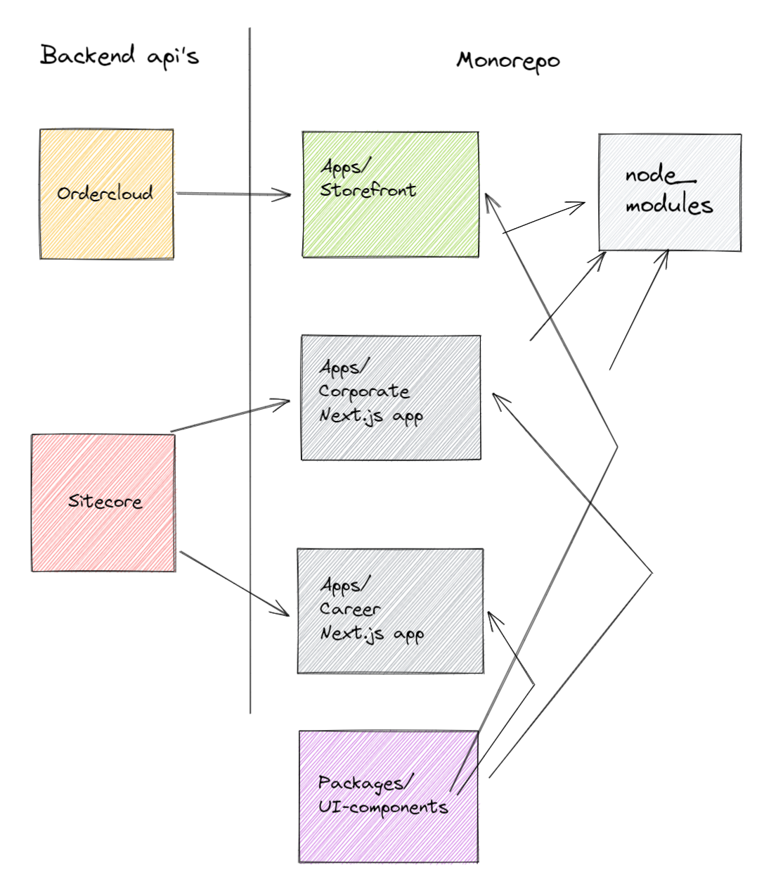
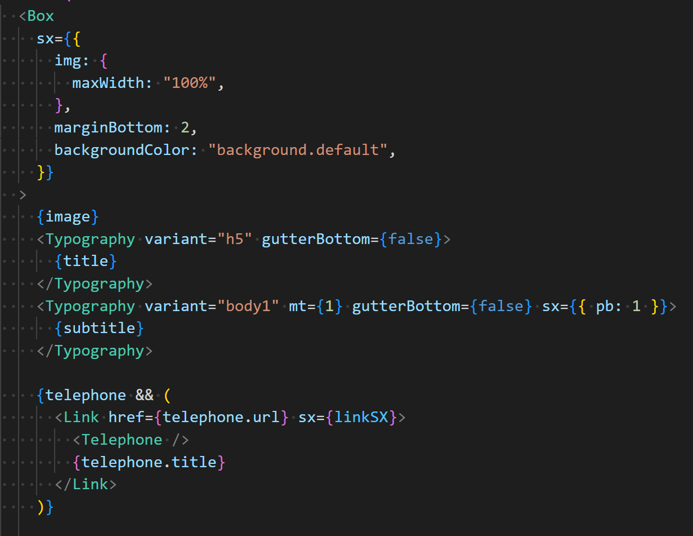
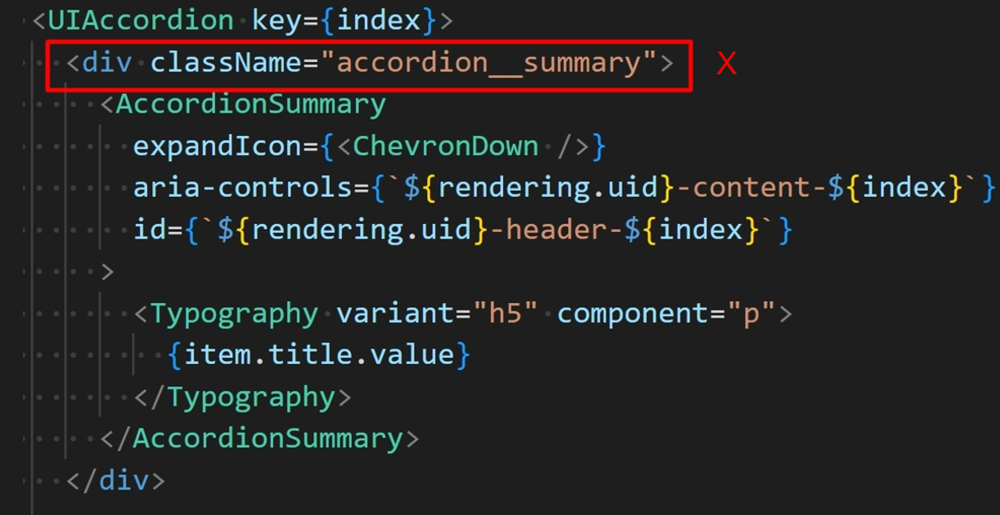
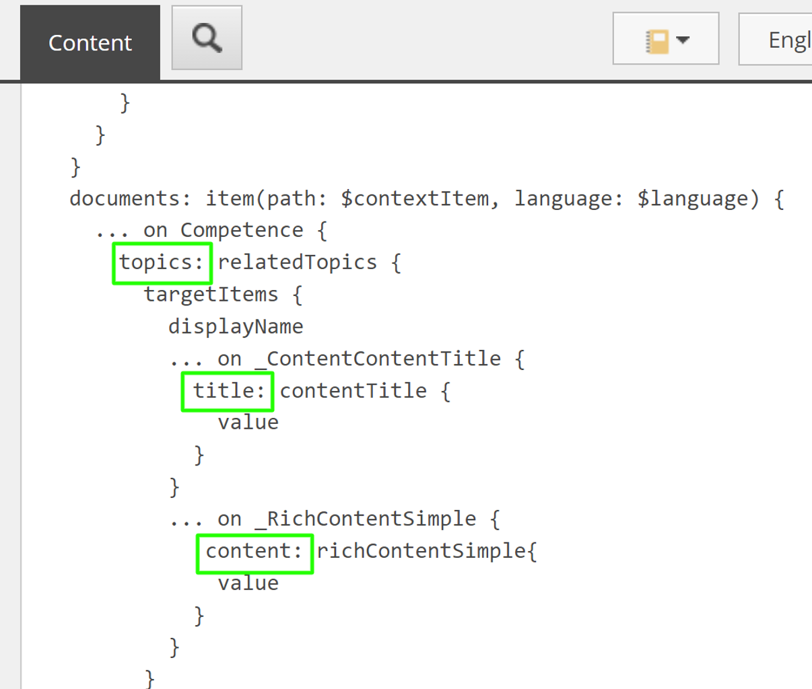
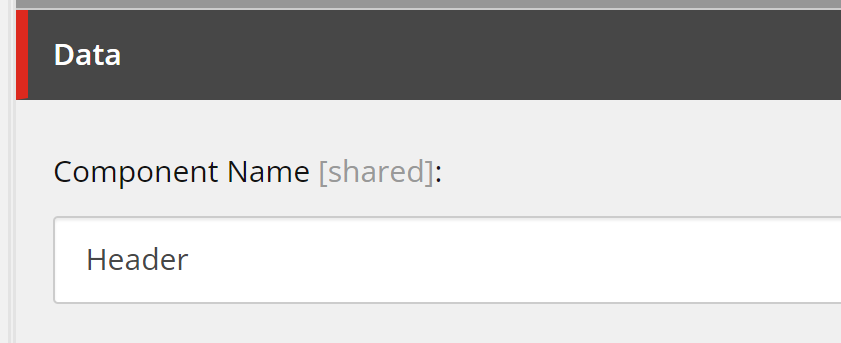
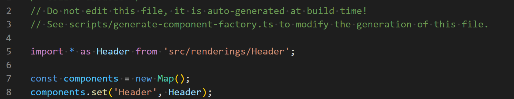
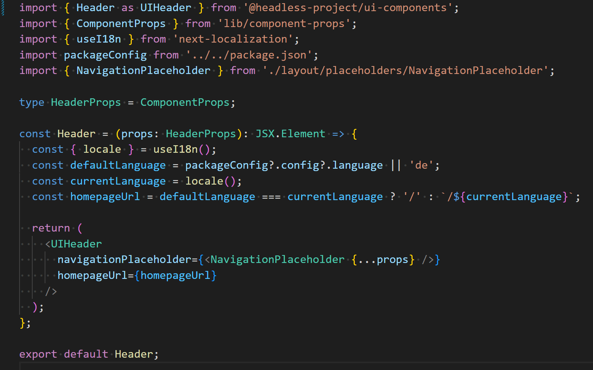

I recently worked on a headless project with Sitecore, the way of working I choose there worked really well in my opinion. In this post, I like to talk about the choices I made and how they helped the team create a good workflow.

What do I mean by scalable in this context? By scalable I mean a few things:

- The head should be able to work with data model changes.
- The head should be able to perform well even if there are hundreds of different components in the application.
- The head should be able to look good in different color themes, different font sizes, different spacings, etc. 
- The team that develops the head should be able to scale well, and new members should be able to easily integrate into the project without any domain or Sitecore knowledge.

## Monorepo
Within the Monorepo I created a clear separation between UI components and the Sitecore JSS Next.js application. 
See the following drawing:

This monorepo is using NPM workspaces in combination with Turborepo, this works well but there are a lot of similar tools that achieve the same thing.
With monorepo's it's common to have **packages** and **apps**. Packages refer to internal codebases and apps are meant for applications that will be seen by a non-technical end-user. See the example from Turborepo for an [excellent example](https://turborepo.org/docs/getting-started/create-new#2-exploring-your-new-repo).

In the drawing above we have a couple of apps and packages: 
- **UI components**, this is where the front-end developers create their React components in [Storybook](https://storybook.js.org/) out of the context of the client's project or Sitecore
- **Next.js corporate app**, the Sitecore JSS Next.js SDK connecting to the Corporate JSS website setup in Sitecore. This app is depending on the UI components package.
- **Next.js career app**, the same as above but pointing at a different website within Sitecore
- **Apps/storefront**, a fictional example of an app connected to [Sitecore Ordercloud](https://ordercloud.io/). This doesn't exist (yet), but it explains the need of creating components that can work in all sorts of applications within the same monorepo.

## Component system / CSS JS
I'm a big fan of not re-inventing the wheel on simple components that exist on all projects (Accordion/Tabs etc). Although they are easily created from scratch I see a lot of examples that are built poorly or are not accessible. When using a base component system like [MUI](https://mui.com/) or [Reach](https://reach.tech/) you don't have to manually add the correct aria attributes and you're ensured they work using the keyboard, screen reader, etc.

For this project, I picked MUI as a base system for all our components. The components are great and easily customized (no it doesn't have to look like material UI) but you also get a good theming system based on [Emotion](https://emotion.sh/) (a styled component library). 

This theming system allows you to create consistency in the design implementation. And all this while using the IntelliSense of Typescript. 

Even when you don't want to use any of the components from MUI I would still consider using it as an Emotion boilerplate. It works great with Next.js apps (including the Sitecore JSS Next.js SDK). The CSS is automatically code-split, meaning that you can have 100s of components in your application but still a small CSS/JS bundle for the end-user. 

## Rules of engagement
Couple of rules I try to live by on this project.

### Build your component with theme variables (support for multiple themes)

Avoid hard-coded spacing units and colors as much as possible. This way the components can be globally adjusted to be used in all sorts of contexts. 

### Never use mark-up or styling in client-facing app

Don't add class names or styling to the React components within you're Sitecore consuming Next.js apps. The whole point of this setup is to have a clear separation between UI components and Sitecore-related stuff. If this is done anyway, the design system created in Storybook is not leading anymore.

### Use Graphql aliases where possible

When Graphql queries, [integrated or connected](https://doc.sitecore.com/xp/en/developers/hd/190/sitecore-headless-development/integrated-graphql-in-jss-apps.html), the rendering will be more future-proof if aliases are used. If the property names change in the future, the rendering component will still work. Only the query will need to be changed.

## Connect component to Sitecore
Now when all the above is done, it's very easy to create a React rendering for Sitecore. 
On the project, we specifically refer to **React renderings** within the Sitecore Next.js app. The components with the UI components package are called just components. This prevents confusion. 

1. Create a component within the JSS Next.js app as specified in Sitecore 

2. Component should get registered in the componentFactory.ts file automatically (using Sitecore JSS Bootstrap script)

3. Now, within the React rendering, refer to the component from the "UI-components" package, map the props and it's done!
