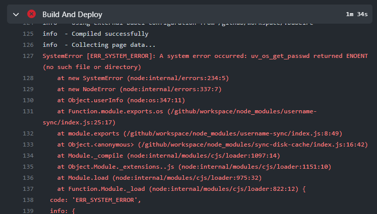
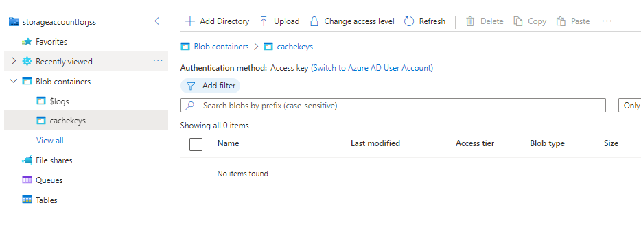
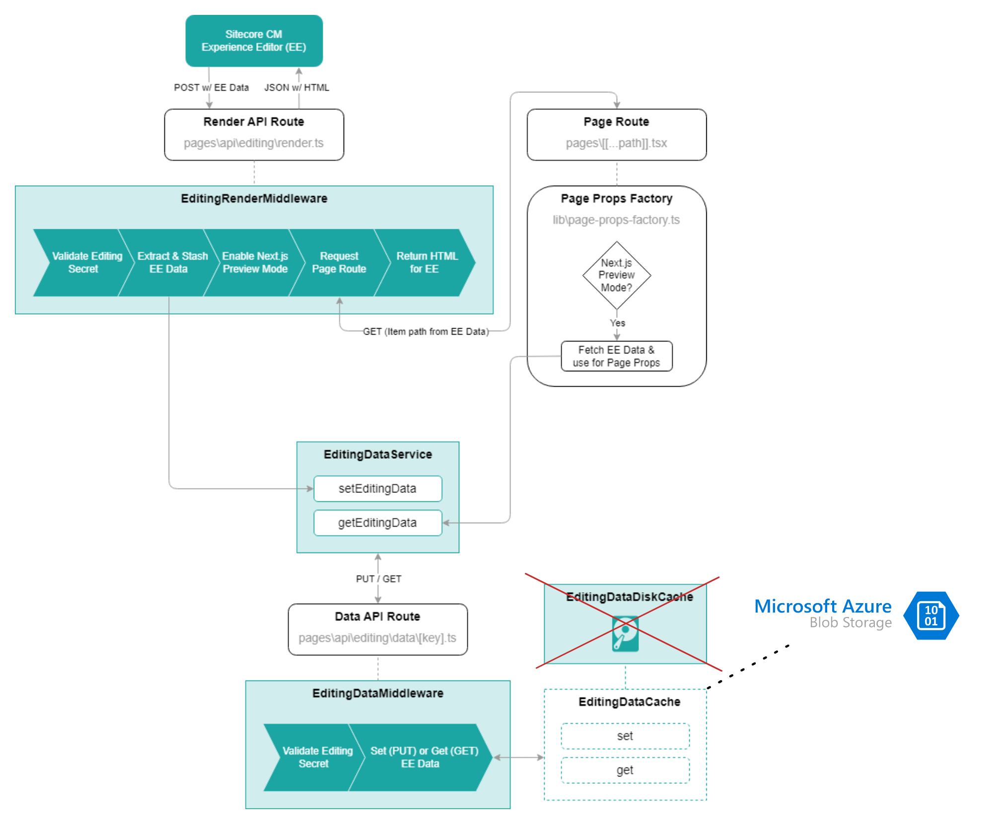

Azure [announced a few weeks ago](https://techcommunity.microsoft.com/t5/apps-on-azure-blog/extending-next-js-support-in-azure-static-web-apps/ba-p/3627975) that they now also support the non-static features from Next.js (e.g. [Incremental Static Regeneration](https://nextjs.org/docs/basic-features/data-fetching/incremental-static-regeneration) & [Server Side Rendering](https://nextjs.org/docs/basic-features/data-fetching/get-server-side-props)) on Azure Static Web Apps(SWA).

Although I've already had a way of [hosting JSS Next.js](/sitecore-nextjs-without-vercel) on Azure. I was curious to see if I was able to deploy JSS Next.js using **Azure SWA** (I use **SWA** as abbreviation for Static Web App from here).

Of course nothing is easy, so let's run through the problems I've had.

## Problem 1, getting it deployed
I created a new Sitecore JSS project using the [JSS CLI](https://doc.sitecore.com/xp/en/developers/hd/190/sitecore-headless-development/walkthrough--creating-a-jss-next-js-application-with-the-jss-cli.html). After that I followed the steps to [deploy a hybrid Next.js](https://learn.microsoft.com/en-us/azure/static-web-apps/deploy-nextjs-hybrid) website to Azure. This connects to your GitHub repo and automatically creates a GitHub action. There I got the first problem:

`SystemError [ERR_SYSTEM_ERROR]: A system error occurred: uv_os_get_passwd returned ENOENT (no such file or directory)`.



So the `username-sync` package is the culprit, this is a dependency from the [sync-disk-cache](https://www.npmjs.com/package/sync-disk-cache) npm package. Sitecore JSS is using this npm package to solve the [2kb preview data problem](https://nextjs.org/docs/advanced-features/preview-mode#previewdata-size-limits). 

So apparently the `username-sync` package doesn't play nicely on GitHub actions. I worked around it by [overwriting this package](https://github.com/erwinsmit/swa-jss/tree/master/username-sync) with a hardcoded value.

Before the `next:build` I copied the patch into the node_modules directory overwriting the original npm package.

```json
package.json
"build": "ncp username-sync node_modules/username-sync && npm-run-all --serial bootstrap next:build"
```

And it worked! We now have a nice fast frontend with a fast simple pipeline. But then I went to the Experience Editor...

## Problem 2, EditingDataDiskCache doesn't work
When hitting the Experience Editor I noticed the API routes were returning 500 errors, in Azure Application Insights I got the following errors:

`Editing data cache miss for key 9f1a55c0-ad8b-51e4-8064-6e427bf80000-y3iv6vzpa3 at /tmp/if-you-need-to-delete-this-open-an-issue-sync-disk-cache/editing-data`

I know from [experience](/sitecore-jss-on-azure-functions/) that these errors are coming from the [EditingDataDiskCache](https://github.com/Sitecore/jss/blob/dev/packages/sitecore-jss-nextjs/src/editing/editing-data-cache.ts). Apparently with Azure SWA you can't write and read stuff to the TMP directory. Also configuring a different TMP directory did not fix this problem. 

So, I had to find a different way of saving the *Preview data* somewhere. In Azure this can be done cheap and easy with a Storage account resource. I created a Storage account, added a container to the Blob Storage and now I just had to find a way to read/write from there. 



Luckily Azure has good [documentation](https://learn.microsoft.com/en-us/azure/storage/blobs/storage-quickstart-blobs-nodejs?tabs=environment-variable-windows#upload-blobs-to-a-container) on this and a [NPM package](https://www.npmjs.com/package/@azure/storage-blob).

With this package it's as easy as this to upload blobs.

```javascript
export class EditingDataBlobCache implements EditingDataCache {
  private containerClient: ContainerClient;

  constructor() {
    const blobServiceClient = BlobServiceClient.fromConnectionString(
      process.env.AZURE_STORAGE_CONNECTION_STRING
    );

    this.containerClient = blobServiceClient.getContainerClient(process.env.AZURE_BLOB_CONTAINER);
  }

  async set(key: string, editingData: EditingData): Promise<void> {
    const blobName = key + '.txt';
    const blockBlobClient = this.containerClient.getBlockBlobClient(blobName);
    // Upload data to the blob
    const data = JSON.stringify(editingData);
    const uploadBlobResponse = await blockBlobClient.upload(data, data.length);
  }
```

All I had to do was create a custom [EditingDataDiskCache](https://github.com/erwinsmit/swa-jss/blob/master/src/lib/editing/editing-data-cache.ts) implementation and plug that into the Sitecore JSS code. The plugging is well supported by the JSS codebase, the implementation can be passed as follows on the `api/editing/data/[key].ts` API route:

```javascript
import { EditingDataDiskCache } from 'lib/editing/editing-data-cache';
const handler = new EditingDataMiddleware({ editingDataCache: editingDataCache }).getHandler();
```

So the architecture looks as illustrated below. This is an updated diagram from the [Sitecore documentation](https://doc.sitecore.com/xp/en/developers/hd/190/sitecore-headless-development/architecture-and-apis-for-integrating-jss-next-js-apps-with-sitecore-editors.html) where the regular disk cache is replaced with our own implementation. 



And now it all works! So do I prefer using Azure SWA over my own custom [solution](/sitecore-nextjs-without-vercel)? I think I do, mainly for these reasons:

- The API routes are automatically transformed into Azure Functions
- Deploying is much easier, no large custom pipelines, just use the pipeline from Azure SWA, configure the environment variables and you're good to go!

Sometimes you have to kill your babies. At least I've learned a lot about Next.js & JSS in the process!

For the code, have a look at my [repo](https://github.com/erwinsmit/swa-jss). The required customizations can be found in the folder [src/lib/editing](https://github.com/erwinsmit/swa-jss/tree/master/src/lib/editing).


