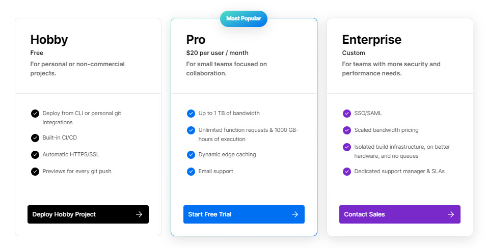
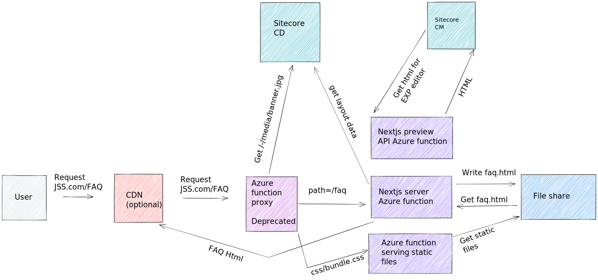
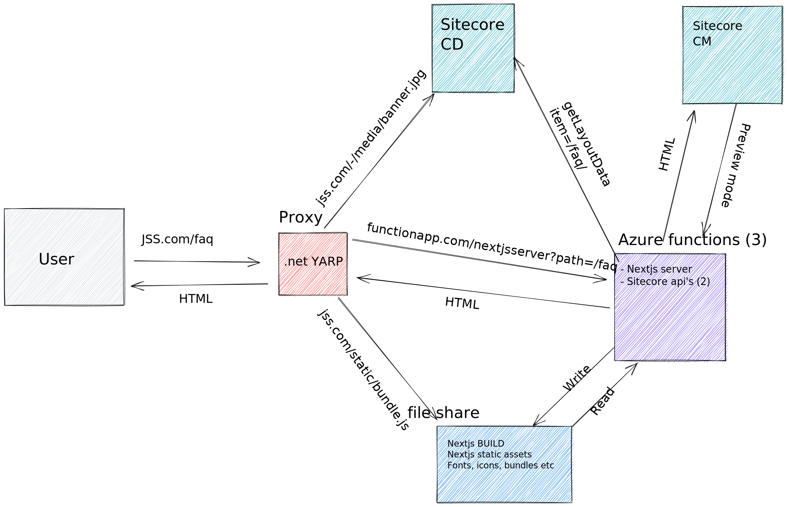

As we all know by now, Vercel is a great platform to host your Next.js apps. I currently use it for some small projects and I love the developer experience.
It's so easy to handle deployments, preview pull requests (you get a unique URL for each pull request), real performance monitoring (using [Core Web Vitals](https://web.dev/vitals/)), and much more. 

But... There are some drawbacks to Vercel.

- Most clients my from my employer [Macaw](https://www.macaw.nl) already pay for a hosting provider, in the Microsoft world, this is Azure. It's hard to also sell Vercel in that case.

- The pricing is hard to predict, it goes from **free** to **10 dollars a month** to **enterprise**. In Azure for example this is more transparent, with the [cost calculator](https://azure.microsoft.com/en-us/pricing/calculator/) you can get a decent estimate.





- GDPR, is especially a hard requirement for German clients. The GDPR is more strict in Germany than in other countries, although Vercel claims to cover GDPR in the EU, it does not seem to make the same amount of effort as Azure with a dedicated [German cloud](https://azure.microsoft.com/en-us/support/legal/privacy-statement/germany/). Disclaimer: Legal stuff is not my strong suit

I understand that some of these issues are not a problem when you use [Sitecore XM Cloud](https://www.sitecore.com/products/xm-cloud). Sitecore won't be hosted on Azure and Vercel comes as a package with the deal (as I understand). However, that's still in the future and some clients might not want to use XM Cloud because they prefer to host Sitecore themselves. 

So, it's worth discovering options on how to do all this without the dependency on Vercel. 
We did just that last year.

## Old solution,
Last year I've worked on a way of hosting Sitecore Next.js with Azure:
- [Next.js on Azure Functions](/nextjs-on-azure-functions/)
- [Deploy Azure Functions with Github Actions](/deploy-azure-functions-github-actions/)
- [Sitecore JSS on Azure functions](/sitecore-jss-on-azure-functions/)

This diagram explains how it all works together:



When I worked on this Azure Functions version 3 was the latest version. Now it's version 4 and proxies are not [supported anymore](https://learn.microsoft.com/en-us/azure/azure-functions/functions-proxies#legacy-functions-proxies).
This December, support for Azure Functions version 3 will be switched off so this solution is not viable anymore. 

## A new proxy
So we got back to the drawing board and came up with the following solution:



Instead of using Azure Function proxies a .net application with [YARP (Yet another reverse proxy)](https://microsoft.github.io/reverse-proxy/) is used. What I like about YARP is that you almost need no code at all to get it running.
Almost all the proxy rules are configured through the appsettings alone, see: https://github.com/macaw-cad/nextjs-on-azure/blob/main/YarpProxy/appsettings.Development.json

Only for the static files from Next.js a couple of lines of code are necessary to mount the file share.

```js
var nextMount = builder.Configuration.GetValue<string>("NextMount");

app.UseStaticFiles(new StaticFileOptions { 
    FileProvider = new PhysicalFileProvider(nextMount),    
    RequestPath = "/_next"
});
```

That was pretty much it, we were able to re-use the code from the old solution and simply replaced the Azure functions proxy with a different one. 

Just after I wrote this blog post, Azure announced that Azure Static Web Apps will support Next.js with ISR/SSR & API routes soon. See the announcement about [Next.js support here](https://techcommunity.microsoft.com/t5/apps-on-azure-blog/extending-next-js-support-in-azure-static-web-apps/ba-p/3627975).

Will be interesting to see if the Sitecore JSS Next.js SDK will also work with this, perhaps coming up in a blog post soon!
