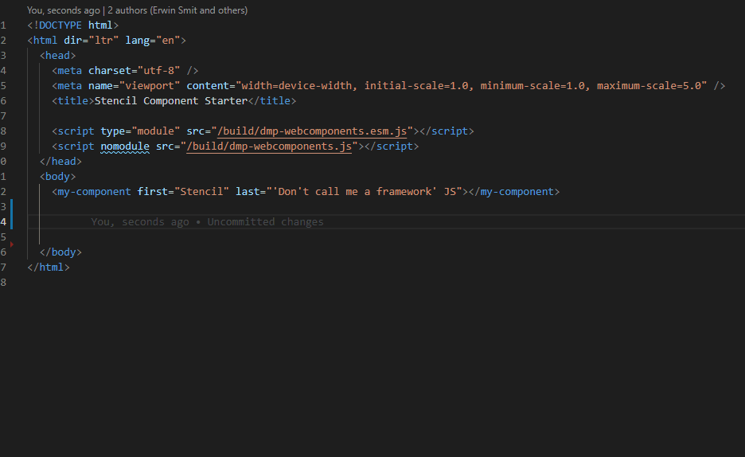

As discussed in the previous blogpost we are happy with the combination of [Sitecore SXA & Stencil webcomponents](https://www.erwinsmit.com/make-your-sxa-site-perform/). However there was a small detail that was annoying me... 

StencilJS has great [Typescript support](https://stenciljs.com/docs/typed-components#typed-components) so when you use Stencil webcomponents in .TSX files you get great intellisense in VS Code.
With minimal effort you can also generate a custom-elements.json for intellisense on your Stencil Components in static .html files.

To do so, add this object to your stencil.config.ts:
```javascript
{ 
    type: 'docs-vscode',
    file: './{replace-with-your-dist-path}/custom-elements.json'
}
```

When Stencil created the json file, add a reference in .vscode/settings.json:
```json
{
    "html.customData": ["./{replace-with-your-dist-path}/custom-elements.json"]
}
``` 

Now you get intellisense on static html files!


## Now what about Scriban?
By default VS Code does not support Scriban so you will need to install an extension. You can either install a standard [Scriban extension](https://marketplace.visualstudio.com/items?itemName=xoofx.scriban) or the great [Sitecore Scriban Extension](https://marketplace.visualstudio.com/items?itemName=adamnaj.sitecore-scriban) that also gives you autocompletion on Sitecore specific methods and objects. At the writing of this blog there is no support yet for intellisense on Stencil Components, but when [version 0.2.1](https://github.com/AdamNaj/SitecoreScriban-vscode/pull/2) is released you will get the same great intellisense on your Scriban files as well! It's small improvements on developer experience like this that can make a great difference in the daily lives of Sitecore developers. 